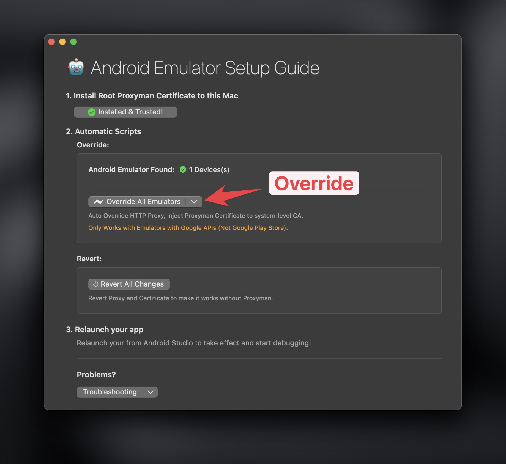
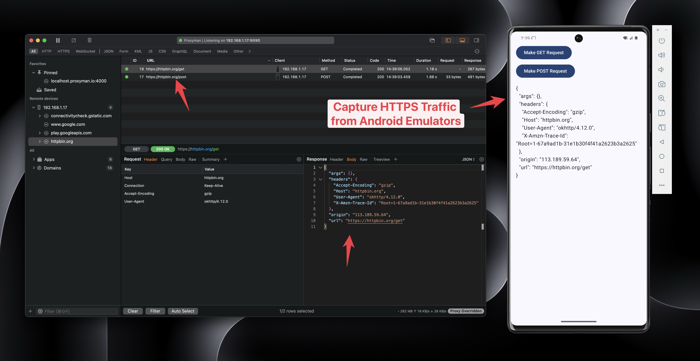

# Proxyman Android Sample App

This is a sample app that demonstrates how to use the Proxyman to capture HTTP/HTTPS traffic on Android Emulators.

## Prerequisites

- Android Studio
- Proxyman
- Android Emulator

## How to start on Android Emulator

1. Clone the repository
2. Open the project in Android Studio
3. Create a new Android Emulator. Make sure it's Google APIs version, not a Play Store Version.
4. Start the app on the Android Emulator
5. Open Proxyman -> Certificates Menu -> Install Certificate on Android -> Emulators…



6. Click on the Override Button
7. Relaunch your app and test it.



8. Done

## How to start on real Android device

1. Clone the repository
2. Open the project in Android Studio
3. Open Proxyman -> Certificates Menu -> Install Certificate on Android -> Physical Devices -> Follow the steps by steps instructions
4. Verify complete the 5th steps

- Add res/xml/network_security_config.xml

```xml
<?xml version="1.0" encoding="utf-8"?>
<manifest xmlns:android="http://schemas.android.com/apk/res/android"
    xmlns:tools="http://schemas.android.com/tools">

    <uses-permission android:name="android.permission.INTERNET" />

    <application
        android:allowBackup="true"
        android:dataExtractionRules="@xml/data_extraction_rules"
        android:fullBackupContent="@xml/backup_rules"
        android:icon="@mipmap/ic_launcher"
        android:label="@string/app_name"
        android:roundIcon="@mipmap/ic_launcher_round"
        android:supportsRtl="true"
        android:theme="@style/Theme.Proxyman_Sample_OKHTTP_App"
        tools:targetApi="31"
        android:networkSecurityConfig="@xml/network_security_config">
        <activity
            android:name=".MainActivity"
            android:exported="true"
            android:label="@string/app_name"
            android:theme="@style/Theme.Proxyman_Sample_OKHTTP_App">
            <intent-filter>
                <action android:name="android.intent.action.MAIN" />

                <category android:name="android.intent.category.LAUNCHER" />
            </intent-filter>
        </activity>
    </application>

</manifest>
```

- Add to AndroidManifest.xml

```xml
<?xml version="1.0" encoding="utf-8"?>
<manifest xmlns:android="http://schemas.android.com/apk/res/android"
    xmlns:tools="http://schemas.android.com/tools">

    <uses-permission android:name="android.permission.INTERNET" />

    <application
        android:allowBackup="true"
        android:dataExtractionRules="@xml/data_extraction_rules"
        android:fullBackupContent="@xml/backup_rules"
        android:icon="@mipmap/ic_launcher"
        android:label="@string/app_name"
        android:roundIcon="@mipmap/ic_launcher_round"
        android:supportsRtl="true"
        android:theme="@style/Theme.Proxyman_Sample_OKHTTP_App"
        tools:targetApi="31"
        android:networkSecurityConfig="@xml/network_security_config">
        <activity
            android:name=".MainActivity"
            android:exported="true"
            android:label="@string/app_name"
            android:theme="@style/Theme.Proxyman_Sample_OKHTTP_App">
            <intent-filter>
                <action android:name="android.intent.action.MAIN" />

                <category android:name="android.intent.category.LAUNCHER" />
            </intent-filter>
        </activity>
    </application>

</manifest>
```

5. Start the app and test it on Proxyman
6. Done